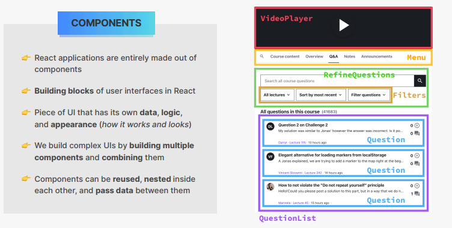
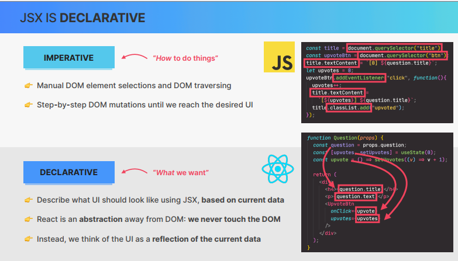
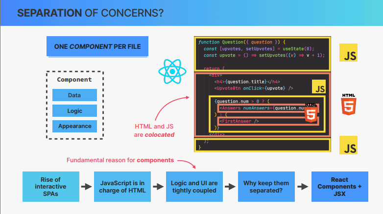
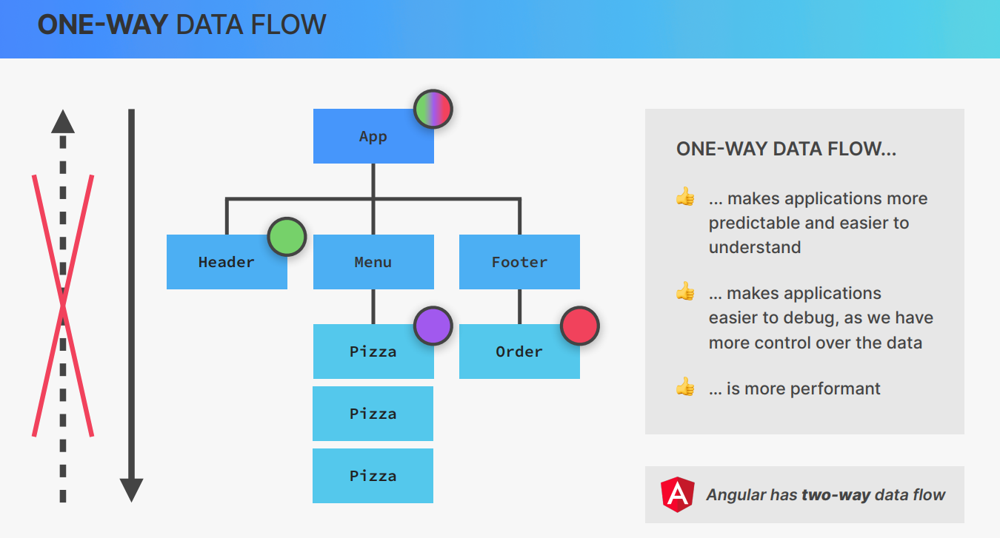

# Rendering the Root Component and Strict Mode

**Notes**:

- Webpack which is the module bundler in create-react-app expects the entry point to be called index.js

- Component must start with an upper case

- Strict Mode
  
  - StrictMode is a component that is part of React
  
  - During development it will render all components twice in order to find certain bugs 
  
  - React will also check if we are using outdated parts of the React API
  
  ```js
  import React from "react";
  
  import ReactDOM from "react-dom/client";
  
  function App() {
  
    return <h1>Hello React!</h1>;
  
  }
  
  //React v18
  
  const root = ReactDOM.createRoot(document.getElementById("root"));
  
  // Strict mode is a component that is part of react
  
  root.render(
  
    <React.StrictMode>
  
      <App />
  
    </React.StrictMode>
  
  );
  ```

# Before we start coding : Debugging(34)

**Notes**:

- Make sure application is running
  
  - stop and restart
    
    - stop => ctrl + c
    
    - npm start => restart

- Hard reload of browser (Hot module replacement sometimes breaks)

- Keep terminal and devTools always open

- Google the error messages and find recent solutions

- Always work with ESLint warnings

- Check Prettier and ESLint warnings

- Compare code with final version 

## Components as building blocks




# Creating and Reusing a Component

**Notes:**

- Component =>We write components using functions

- Rules When we write component using functions
  
  - functions need to start with an uppercase letter
  
  - Functions needs to return some markup (usually in the form of JSX ) but we can even return nothing like returning null
  
  - Each component can return exactly one element 

- We need to include the new component in our App component 

- All the assets will go to public because Webpack (module bundler) will basically automatically get them from there 

```js
import React from "react";

import ReactDOM from "react-dom/client";

function App() {

  return (

    <div>

      <h1>Hello React!</h1>

      <Pizza />

      <Pizza />

      <Pizza />

    </div>

  );

}

function Pizza() {

  return (

    <div>

      <h2>Pizza Spinaci</h2>

      <p>Tomato, mozarella, spinach, and ricotta cheese</p>

      

    </div>

  );

}

//React v18

const root = ReactDOM.createRoot(document.getElementById("root"));

// Strict mode is a component that is part of react

root.render(

  <React.StrictMode>

    <App />

  </React.StrictMode>

);
```

```js
 const pizzaData = [

  {

    name: "Focaccia",

    ingredients: "Bread with italian olive oil and rosemary",

    price: 6,

    photoName: "pizzas/focaccia.jpg",

    soldOut: false,

  },

  {

    name: "Pizza Margherita",

    ingredients: "Tomato and mozarella",

    price: 10,

    photoName: "pizzas/margherita.jpg",

    soldOut: false,

  },

  {

    name: "Pizza Spinaci",

    ingredients: "Tomato, mozarella, spinach, and ricotta cheese",

    price: 12,

    photoName: "pizzas/spinaci.jpg",

    soldOut: false,

  },

  {

    name: "Pizza Funghi",

    ingredients: "Tomato, mozarella, mushrooms, and onion",

    price: 12,

    photoName: "pizzas/funghi.jpg",

    soldOut: false,

  },

  {

    name: "Pizza Salamino",

    ingredients: "Tomato, mozarella, and pepperoni",

    price: 15,

    photoName: "pizzas/salamino.jpg",

    soldOut: true,

  },

  {

    name: "Pizza Prosciutto",

    ingredients: "Tomato, mozarella, ham, aragula, and burrata cheese",

    price: 18,

    photoName: "pizzas/prosciutto.jpg",

    soldOut: false,

  },

];
```

# What is JSX?

**Notes**:


 

# Creating More Components(38)

**Notes**:

- We can write components as function defination , function expressions and arrow functions

- In the HTML we will no longer see the name of our components

```js
import React from "react";

import ReactDOM from "react-dom/client";

function App() {

  return (

    <div>

      <Header />

      <Menu />

      <Footer />

    </div>

  );

}

function Header() {

  return <h1>Fast React Pizza Co.</h1>;

}

function Menu() {

  return (

    <div>

      <h2>Our menu</h2>

      <Pizza />

      <Pizza />

      <Pizza />

      <Pizza />

    </div>

  );

}

function Footer() {

  return (

    <footer>{new Date().toLocaleTimeString()} We're currently open </footer>

  );

  //return React.createElement("footer", null, "We're currently open!");

}

function Pizza() {

  return (

    <div>

      <h2>Pizza Spinaci</h2>

      <p>Tomato, mozarella, spinach, and ricotta cheese</p>

      

    </div>

  );

}

//React v18

const root = ReactDOM.createRoot(document.getElementById("root"));

// Strict mode is a component that is part of react

root.render(

  <React.StrictMode>

    <App />

  </React.StrictMode>

);
```

# Javascript Logic in Components(39)

**Notes**:

- Since components are javascript functions we can of course do any javascript in them that we want and that code is simply executed as soon as the function is called(As soon as the component is initialized)

```js
function Footer() {

  const hour = new Date().getHours();

  //console.log(hour);

  const openHour = 12;

  const closeHour = 22;

  const isOpen = hour >= openHour && hour <= closeHour;

  console.log(isOpen);

  // if (hour >= openHour && hour <= closeHour) alert("We're currently open!");

  // else alert("Sorry we're closed");

  return (

    <footer>{new Date().toLocaleTimeString()} We're currently open </footer>

  );

  //return React.createElement("footer", null, "We're currently open!");

}
```

# Seperation of Concerns(40)

**Notes**:





# Styling React Applications(41)

**Notes**:

- React is a library and hence it doesnt have an opinion about styling 

- Webpack takes care of injecting the CSS from the CSS files

```js
import React from "react";

import ReactDOM from "react-dom/client";

import "./index.css";

function App() {

  return (

    <div className="container">

      <Header />

      <Menu />

      <Footer />

    </div>

  );

}

function Header() {

  //const style = { color: "red", fontSize: "48px", textTransform: "uppercase" };

  const style = { color: "red", fontSize: "48px", textTransform: "uppercase" };

  return (

    <header className="header">

      <h1 style={{}}>Fast React Pizza Co.</h1>

    </header>

  );

}

function Menu() {

  return (

    <main className="menu">

      <h2>Our menu</h2>

      <Pizza />

      <Pizza />

      <Pizza />

      <Pizza />

    </main>

  );

}

function Footer() {

  const hour = new Date().getHours();

  //console.log(hour);

  const openHour = 12;

  const closeHour = 22;

  const isOpen = hour >= openHour && hour <= closeHour;

  console.log(isOpen);

  // if (hour >= openHour && hour <= closeHour) alert("We're currently open!");

  // else alert("Sorry we're closed");

  return (

    <footer className="footer">

      {new Date().toLocaleTimeString()} We're currently open{" "}

    </footer>

  );

  //return React.createElement("footer", null, "We're currently open!");

}

function Pizza() {

  return (

    <div>

      <h3>Pizza Spinaci</h3>

      <p>Tomato, mozarella, spinach, and ricotta cheese</p>

      

    </div>

  );

}

//React v18

const root = ReactDOM.createRoot(document.getElementById("root"));

// Strict mode is a component that is part of react

root.render(

  <React.StrictMode>

    <App />

  </React.StrictMode>

);
```

# Passing and receiving props

**Notes:**

- Props is essentially how we pass data between components (From parent component to child component)

- Communication channel between a parent and a child component

To define props we do it in 2 steps 

1. First we pass the props into the component

2. Second we receive the props in the component we pass them into 
- we write props just as if they were normal attributes 

- order in which we pass in the props is completely irrevelant 

- Whenever we want to pass in something that is not a string we have to enter javascript mode (we can pass anything as props)

```js
function Menu() {

  return (

    <main className="menu">

      <h2>Our menu</h2>

      <Pizza

        name="Pizza Spinaci"

        ingredients="Tomato, mozarella, spinach, and ricotta cheese"

        photoName="pizzas/spinaci.jpg"

        price={10}

      />

      <Pizza

        name="Pizza Funghi"

        ingredients="Tomato,mushrooms"

        price={12}

        photoName="pizzas/funghi.jpg"

      />

    </main>

  );

}

function Pizza(props) {

  console.log(props);

  return (

    <div className="pizza">

      <h3>{props.name}</h3>

      <div>

        <p>{props.ingredients}</p>

        

        <span>{props.price + 3}</span>

      </div>

    </div>

  );

}
```

# Props,Immutability and one way data flow




# The Rules of JSX


# Rendering Lists

-    Rendering lists is when we have an array and we want to create one component for each element of the array

- Each child in a list should have a unique key property , key is a prop which is internal to react which it needs in order for some performance optimizations(must be unique)

- We use maps for rendeing lists is because this is the only way we get JSX is by creating a new array (thats why we use map)
  
  ```js
  function Menu() {
  
    return (
  
      <main className="menu">
  
        <h2>Our menu</h2>
  
        <ul className="pizzas">
  
          {pizzaData.map((pizza) => (
  
            <Pizza pizzaObj={pizza} key={pizza.name} />
  
          ))}
  
        </ul>
  
      </main>
  
    );
  
  }
  
  function Pizza(props) {
  
    console.log(props);
  
    return (
  
      <li className="pizza">
  
        <div>
  
          <h3>{props.pizzaObj.name}</h3>
  
          <p>{props.pizzaObj.ingredients}</p>
  
          
  
          <span>{props.pizzaObj.price}</span>
  
        </div>
  
      </li>
  
    );
  
  }
  ```

# Conditional Rendering with &&

- Short Circuiting => if we have some truthy value and then if we use the && operator then the second part of the && operator will be returned in case that the condition is true

- React does not render a boolean value (true/false) to the DOM 

- React will not render true or false but will happily render 0 

- We should try to do conditional rendering with the ternary operator

```js
 function Footer() {

  const hour = new Date().getHours();

  //console.log(hour);

  const openHour = 12;

  const closeHour = 22;

  const isOpen = hour >= openHour && hour <= closeHour;

  console.log(isOpen);

  // if (hour >= openHour && hour <= closeHour) alert("We're currently open!");

  // else alert("Sorry we're closed");

  return (

    <footer className="footer">

      {isOpen && (

        <div className="order">

          <p>We're open until {closeHour}:00 .Comw visit us or order online</p>

          <button className="btn">Order</button>

        </div>

      )}

    </footer>

  );
```

```js
function Menu() {

  const pizzas = pizzaData;

  //const pizzas = [];

  const numPizzas = pizzas.length;

  return (

    <main className="menu">

      <h2>Our menu</h2>

      {numPizzas > 0 && (

        <ul className="pizzas">

          {pizzas.map((pizza) => (

            <Pizza pizzaObj={pizza} key={pizza.name} />

          ))}

        </ul>

      )}

    </main>

  );

}
```

# Conditional Rendering with Ternary Operators

- We cannot write any if-else inside javascript mode , because we need to write something that actually produces a value and an if-else statement does not produce a value 

```js
function Menu() {

  const pizzas = pizzaData;

  //const pizzas = [];

  const numPizzas = pizzas.length;

  return (

    <main className="menu">

      <h2>Our menu</h2>

      {numPizzas > 0 ? (

        <ul className="pizzas">

          {pizzas.map((pizza) => (

            <Pizza pizzaObj={pizza} key={pizza.name} />

          ))}

        </ul>

      ) : (

        <p>We're still working on our menu.Please come back later</p>

      )}

    </main>

  );

}
```

```js
function Footer() {

  const hour = new Date().getHours();

  //console.log(hour);

  const openHour = 20;

  const closeHour = 22;

  const isOpen = hour >= openHour && hour <= closeHour;

  console.log(isOpen);

  // if (hour >= openHour && hour <= closeHour) alert("We're currently open!");

  // else alert("Sorry we're closed");

  return (

    <footer className="footer">

      {isOpen ? (

        <div className="order">

          <p>We're open until {closeHour}:00 .Comw visit us or order online</p>

          <button className="btn">Order</button>

        </div>

      ) : (

        <p>

          We're happy to welcome you between {openHour}:00 and {closeHour}:00

        </p>

      )}

    </footer>

  );

  

}
```

# Conditional Rendering with Multiple Returns

- We can return based on a condition 

```js
function Pizza(props) {

  console.log(props);

  if (props.pizzaObj.soldOut) return null;

  return (

    <li className="pizza">

      <div>

        <h3>{props.pizzaObj.name}</h3>

        <p>{props.pizzaObj.ingredients}</p>

        

        <span>{props.pizzaObj.price}</span>

      </div>

    </li>

  );

}
```

# Extracting JSX into a new Component

```js
function Footer() {

  const hour = new Date().getHours();

  //console.log(hour);

  const openHour = 20;

  const closeHour = 22;

  const isOpen = hour >= openHour && hour <= closeHour;

  console.log(isOpen);

  // if (hour >= openHour && hour <= closeHour) alert("We're currently open!");

  // else alert("Sorry we're closed");

  return (

    <footer className="footer">

      {isOpen ? (

        <Order closeHour={openHour} />

      ) : (

        <p>

          We're happy to welcome you between {openHour}:00 and {closeHour}:00

        </p>

      )}

    </footer>

  );

  //return React.createElement("footer", null, "We're currently open!");

}

function Order(props) {

  return (

    <div className="order">

      <p>

        We're open until {props.closeHour}:00 .Comw visit us or order online

      </p>

      <button className="btn">Order</button>

    </div>

  );

}

```

# Destructuring Props

- All components receive props object (if it doesnt receive props it will be empty)

```js
function Menu() {

  const pizzas = pizzaData;

  //const pizzas = [];

  const numPizzas = pizzas.length;

  return (

    <main className="menu">

      <h2>Our menu</h2>

      {numPizzas > 0 ? (

        <ul className="pizzas">

          {pizzas.map((pizza) => (

            <Pizza pizzaObj={pizza} key={pizza.name} />

          ))}

        </ul>

      ) : (

        <p>We're still working on our menu.Please come back later</p>

      )}

    </main>

  );

}

function Pizza({ pizzaObj }) {

  //console.log(props);

  if (pizzaObj.soldOut) return null;

  return (

    <li className="pizza">

      <div>

        <h3>{pizzaObj.name}</h3>

        <p>{pizzaObj.ingredients}</p>

        

        <span>{pizzaObj.price}</span>

      </div>

    </li>

  );

}


```

```js
function Footer() {

  const hour = new Date().getHours();

  //console.log(hour);

  const openHour = 20;

  const closeHour = 22;

  const isOpen = hour >= openHour && hour <= closeHour;

  console.log(isOpen);

  // if (hour >= openHour && hour <= closeHour) alert("We're currently open!");

  // else alert("Sorry we're closed");

  return (

    <footer className="footer">

      {isOpen ? (

        <Order closeHour={openHour} openHour={openHour} />

      ) : (

        <p>

          We're happy to welcome you between {openHour}:00 and {closeHour}:00

        </p>

      )}

    </footer>

  );

  //return React.createElement("footer", null, "We're currently open!");

}

function Order({ closeHour, openHour }) {

  return (

    <div className="order">

      <p>

        We're open from {openHour}:00 until {closeHour}:00 .Comw visit us or

        order online

      </p>

      <button className="btn">Order</button>

    </div>

  );

}

```
