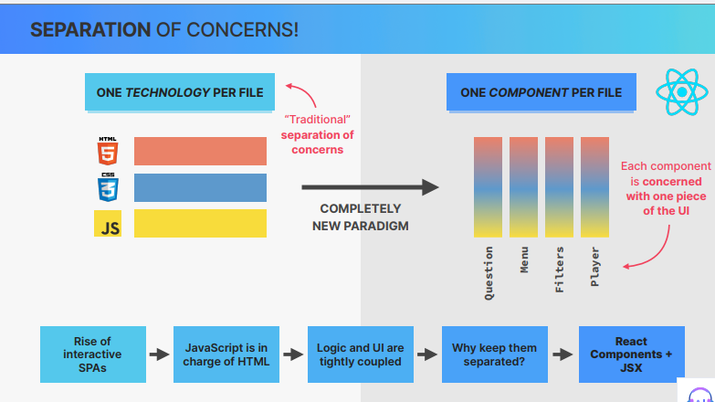

### Rendering the Root Component and Strict Mode

**Notes**:

- Webpack which is the module bundler in create-react-app expects the entry point to be called index.js

- Component must start with an upper case

- Strict Mode
  
  - StrictMode is a component that is part of React
  
  - During development it will render all components twice in order to find certain bugs 
  
  - React will also check if we are using outdated parts of the React API
  
  ```js
  import React from "react";
  
  import ReactDOM from "react-dom/client";
  
  function App() {
  
    return <h1>Hello React!</h1>;
  
  }
  
  //React v18
  
  const root = ReactDOM.createRoot(document.getElementById("root"));
  
  // Strict mode is a component that is part of react
  
  root.render(
  
    <React.StrictMode>
  
      <App />
  
    </React.StrictMode>
  
  );
  ```

### Before we start coding : Debugging(34)

**Notes**:

- Make sure application is running
  
  - stop and restart
    
    - stop => ctrl + c
    
    - npm start => restart

- Hard reload of browser (Hot module replacement sometimes breaks)

- Keep terminal and devTools always open

- Google the error messages and find recent solutions

- Always work with ESLint warnings

- Check Prettier and ESLint warnings

- Compare code with final version 

#### Components as building blocks


### Creating and Reusing a Component

**Notes:**

- Component =>We write components using functions

- Rules When we write component using functions
  
  - functions need to start with an uppercase letter
  
  - Functions needs to return some markup (usually in the form of JSX ) but we can even return nothing like returning null
  
  - Each component can return exactly one element 

- We need to include the new component in our App component 

- All the assets will go to public because Webpack (module bundler) will basically automatically get them from there 

```js
import React from "react";

import ReactDOM from "react-dom/client";

function App() {

  return (

    <div>

      <h1>Hello React!</h1>

      <Pizza />

      <Pizza />

      <Pizza />

    </div>

  );

}

function Pizza() {

  return (

    <div>

      <h2>Pizza Spinaci</h2>

      <p>Tomato, mozarella, spinach, and ricotta cheese</p>

      

    </div>

  );

}

//React v18

const root = ReactDOM.createRoot(document.getElementById("root"));

// Strict mode is a component that is part of react

root.render(

  <React.StrictMode>

    <App />

  </React.StrictMode>

);
```

```js
 const pizzaData = [

  {

    name: "Focaccia",

    ingredients: "Bread with italian olive oil and rosemary",

    price: 6,

    photoName: "pizzas/focaccia.jpg",

    soldOut: false,

  },

  {

    name: "Pizza Margherita",

    ingredients: "Tomato and mozarella",

    price: 10,

    photoName: "pizzas/margherita.jpg",

    soldOut: false,

  },

  {

    name: "Pizza Spinaci",

    ingredients: "Tomato, mozarella, spinach, and ricotta cheese",

    price: 12,

    photoName: "pizzas/spinaci.jpg",

    soldOut: false,

  },

  {

    name: "Pizza Funghi",

    ingredients: "Tomato, mozarella, mushrooms, and onion",

    price: 12,

    photoName: "pizzas/funghi.jpg",

    soldOut: false,

  },

  {

    name: "Pizza Salamino",

    ingredients: "Tomato, mozarella, and pepperoni",

    price: 15,

    photoName: "pizzas/salamino.jpg",

    soldOut: true,

  },

  {

    name: "Pizza Prosciutto",

    ingredients: "Tomato, mozarella, ham, aragula, and burrata cheese",

    price: 18,

    photoName: "pizzas/prosciutto.jpg",

    soldOut: false,

  },

];
```

### What is JSX?

**Notes**:


 

### Creating More Components(38)

**Notes**:

- We can write components as function defination , function expressions and arrow functions

- In the HTML we will no longer see the name of our components

```js
import React from "react";

import ReactDOM from "react-dom/client";

function App() {

  return (

    <div>

      <Header />

      <Menu />

      <Footer />

    </div>

  );

}

function Header() {

  return <h1>Fast React Pizza Co.</h1>;

}

function Menu() {

  return (

    <div>

      <h2>Our menu</h2>

      <Pizza />

      <Pizza />

      <Pizza />

      <Pizza />

    </div>

  );

}

function Footer() {

  return (

    <footer>{new Date().toLocaleTimeString()} We're currently open </footer>

  );

  //return React.createElement("footer", null, "We're currently open!");

}

function Pizza() {

  return (

    <div>

      <h2>Pizza Spinaci</h2>

      <p>Tomato, mozarella, spinach, and ricotta cheese</p>

      

    </div>

  );

}

//React v18

const root = ReactDOM.createRoot(document.getElementById("root"));

// Strict mode is a component that is part of react

root.render(

  <React.StrictMode>

    <App />

  </React.StrictMode>

);
```

### Javascript Logic in Components(39)

**Notes**:

- Since components are javascript functions we can of course do any javascript in them that we want and that code is simply executed as soon as the function is called(As soon as the component is initialized)

```js
function Footer() {

  const hour = new Date().getHours();

  //console.log(hour);

  const openHour = 12;

  const closeHour = 22;

  const isOpen = hour >= openHour && hour <= closeHour;

  console.log(isOpen);

  // if (hour >= openHour && hour <= closeHour) alert("We're currently open!");

  // else alert("Sorry we're closed");

  return (

    <footer>{new Date().toLocaleTimeString()} We're currently open </footer>

  );

  //return React.createElement("footer", null, "We're currently open!");

}
```

### Seperation of Concerns(40)

**Notes**:




### Styling React Applications(41)

**Notes**:

- React is a library and hence it doesnt have an opinion about styling 

- Webpack takes care of injecting the CSS from the CSS files

```js
import React from "react";

import ReactDOM from "react-dom/client";

import "./index.css";

function App() {

  return (

    <div className="container">

      <Header />

      <Menu />

      <Footer />

    </div>

  );

}

function Header() {

  //const style = { color: "red", fontSize: "48px", textTransform: "uppercase" };

  const style = { color: "red", fontSize: "48px", textTransform: "uppercase" };

  return (

    <header className="header">

      <h1 style={{}}>Fast React Pizza Co.</h1>

    </header>

  );

}

function Menu() {

  return (

    <main className="menu">

      <h2>Our menu</h2>

      <Pizza />

      <Pizza />

      <Pizza />

      <Pizza />

    </main>

  );

}

function Footer() {

  const hour = new Date().getHours();

  //console.log(hour);

  const openHour = 12;

  const closeHour = 22;

  const isOpen = hour >= openHour && hour <= closeHour;

  console.log(isOpen);

  // if (hour >= openHour && hour <= closeHour) alert("We're currently open!");

  // else alert("Sorry we're closed");

  return (

    <footer className="footer">

      {new Date().toLocaleTimeString()} We're currently open{" "}

    </footer>

  );

  //return React.createElement("footer", null, "We're currently open!");

}

function Pizza() {

  return (

    <div>

      <h3>Pizza Spinaci</h3>

      <p>Tomato, mozarella, spinach, and ricotta cheese</p>

      

    </div>

  );

}

//React v18

const root = ReactDOM.createRoot(document.getElementById("root"));

// Strict mode is a component that is part of react

root.render(

  <React.StrictMode>

    <App />

  </React.StrictMode>

);
```
