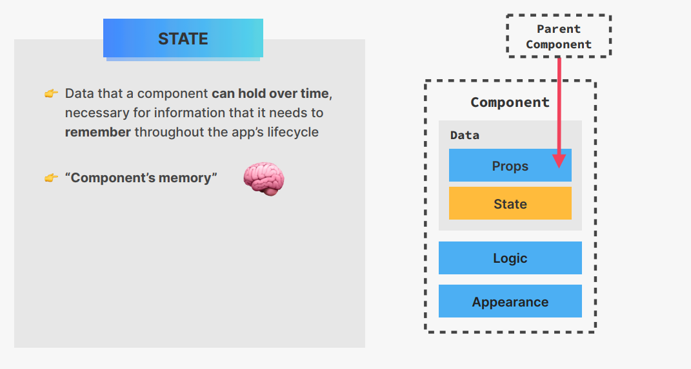
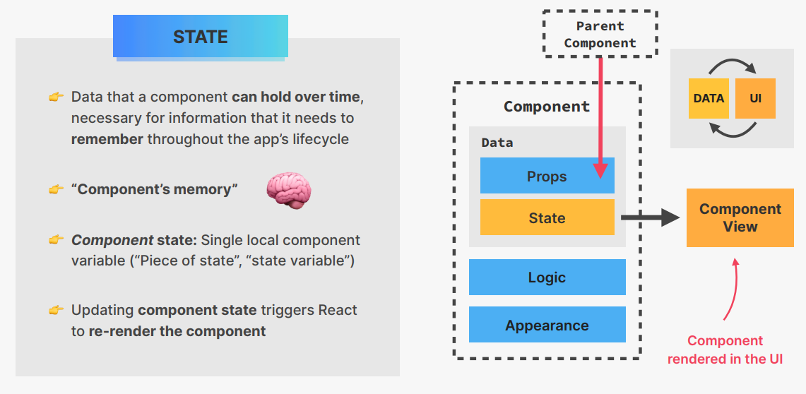
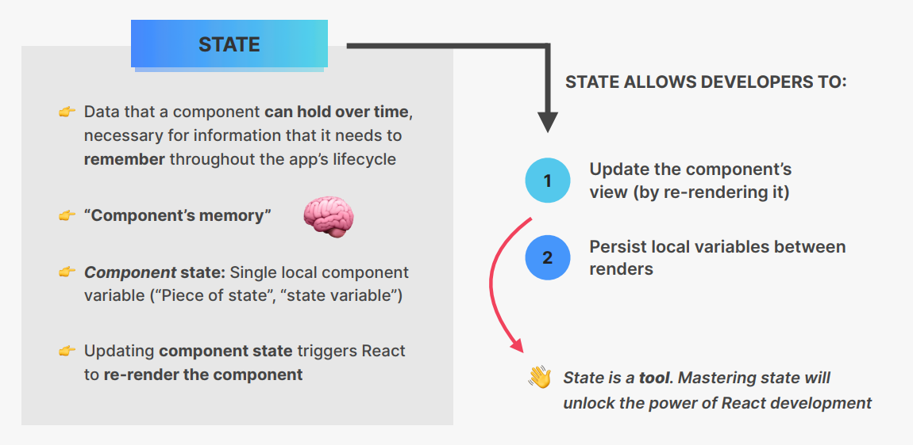
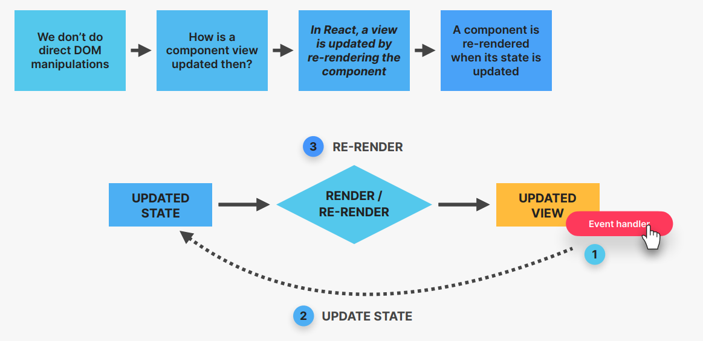
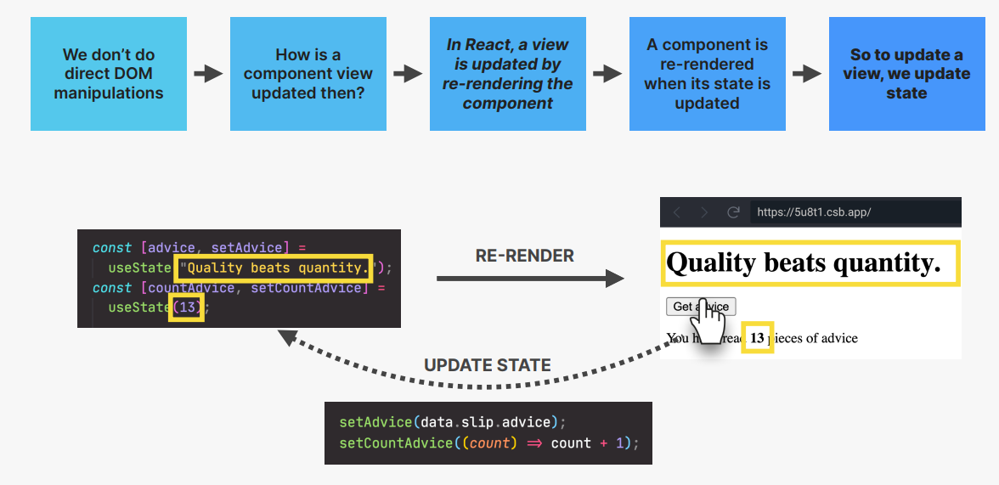
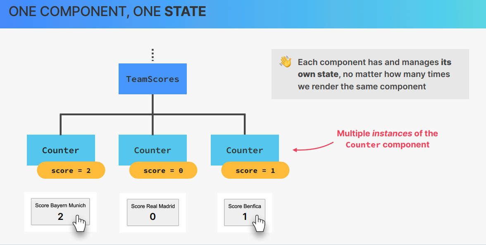
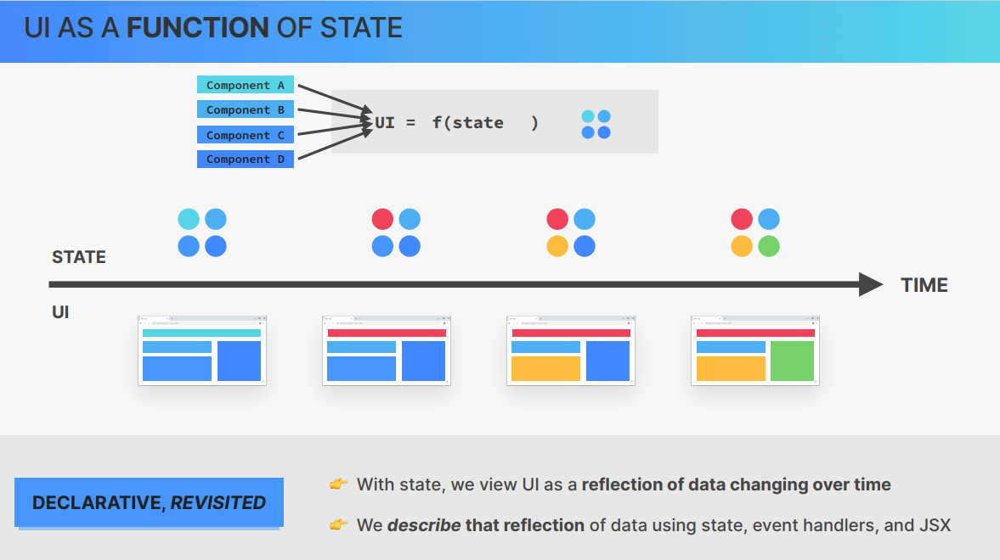
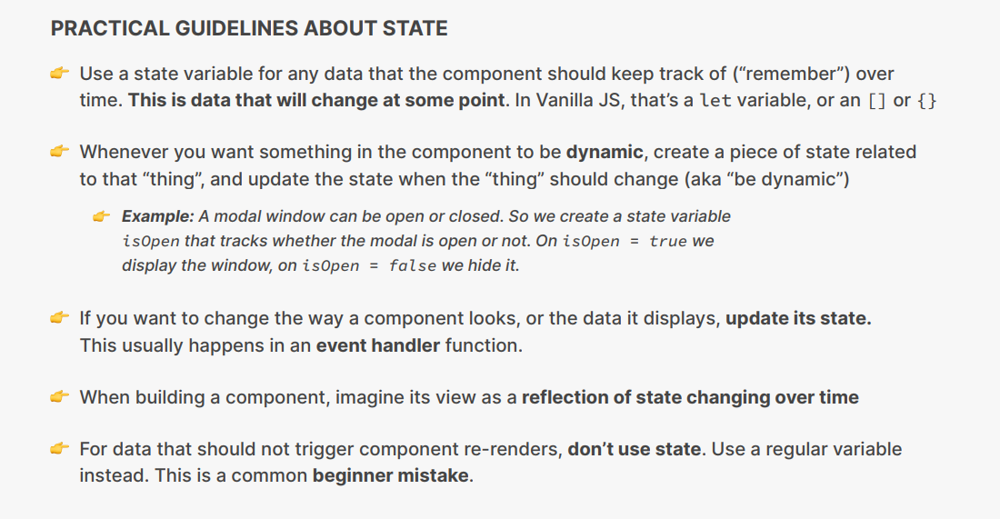

# Lets Build a Steps Component

Usually we use a component App as the root component of our application(App Component is the parent component of all the other components)

App.js

```js
const messages = [

  "Learn React ⚛️",

  "Apply for jobs 💼",

  "Invest your new income 🤑",

];

export default function App() {

  const step = 2;

  return (

    <div className="steps">

      <div className="numbers">

        <div className={`${step >= 1 ? "active" : ""}`}>1</div>

        <div className={`${step >= 2 ? "active" : ""}`}>2</div>

        <div className={`${step >= 3 ? "active" : ""}`}>3</div>

      </div>

      <p className="message">

        Step {step}:{messages[step - 1]}

      </p>

      <div className="buttons">

        <button style={{ backgroundColor: "#7950f2", color: "#fff" }}>

          Previous

        </button>

        <button style={{ backgroundColor: "#7950f2", color: "#fff" }}>

          Next

        </button>

      </div>

    </div>

  );

}
```

index.css

```css
/*

const messages = [

  "Learn React ⚛️",

  "Apply for jobs 💼",

  "Invest your new income 🤑",

];

 */

* {

  box-sizing: border-box;

}

body {

  font-family: sans-serif;

  color: #333;

}

.steps {

  width: 600px;

  background-color: #f7f7f7;

  border-radius: 7px;

  padding: 25px 100px;

  margin: 100px auto;

}

.numbers {

  display: flex;

  justify-content: space-between;

}

.numbers > div {

  height: 40px;

  aspect-ratio: 1;

  background-color: #e7e7e7;

  border-radius: 50%;

  display: flex;

  align-items: center;

  justify-content: center;

  font-size: 18px;

}

.numbers .active {

  background-color: #7950f2;

  color: #fff;

}

.message {

  text-align: center;

  font-size: 20px;

  margin: 40px 0;

  font-weight: bold;

  display: flex;

  flex-direction: column;

  align-items: center;

}

.buttons {

  display: flex;

  justify-content: space-between;

}

.buttons button {

  border: none;

  cursor: pointer;

  padding: 10px 15px;

  border-radius: 100px;

  font-size: 14px;

  font-weight: bold;

  display: flex;

  align-items: center;

  gap: 10px;

}

.buttons button span {

  font-size: 16px;

  line-height: 1;

}

h3 {

  margin: 0;

  text-transform: uppercase;

}

.close {

  position: absolute;

  top: 16px;

  right: 16px;

  border: none;

  background: none;

  cursor: pointer;

  font-size: 40px;

  color: inherit;

}

.close:hover {

  color: #7950f2;

}
```

index.js

```js
import React from "react";

import ReactDOM from "react-dom/client";

import "./index.css";

import App from "./App";

const root = ReactDOM.createRoot(document.getElementById("root"));

root.render(

  <React.StrictMode>

    <App />

  </React.StrictMode>

);
```

# Handling Events the React Way

We do not use addEventListener in React because that is the imperative way of building UIs in React we use a more declarative approach. We will directly listen for the event right on the element where they will happen . we need to write it in camel case we pass in a function and that function will now be executed whenever there is a click happening on the DOM

```jsx
<button

          style={{ backgroundColor: "#7950f2", color: "#fff" }}

          onClick={() => alert("Previous")}

        >

          Previous

        </button>
```

It is not a function call rather a function.if we called the function then as soon as React initializes this component (App Function ) it will automatically call `alert("TEST)`

```jsx
<button

          style={{ backgroundColor: "#7950f2", color: "#fff" }}

          onClick={() => alert("Previous")}

          //This is wrong

          onMouseEnter={alert("TEST")}

        >

          Previous

        </button>
```

We do not directly define the event handler function right in the onClick prop but instead we create a seperate function and pass it there . We create those eventHandler functions right in the component. The handle part  in the event handler function is pretty standard in React development

App.js

```js
const messages = [

  "Learn React ⚛️",

  "Apply for jobs 💼",

  "Invest your new income 🤑",

];

export default function App() {

  const step = 1;

  function handlePrevious() {

    alert("Previous");

  }

  function handleNext() {

    alert("Next");

  }

  return (

    <div className="steps">

      <div className="numbers">

        <div className={`${step >= 1 ? "active" : ""}`}>1</div>

        <div className={`${step >= 2 ? "active" : ""}`}>2</div>

        <div className={`${step >= 3 ? "active" : ""}`}>3</div>

      </div>

      <p className="message">

        Step {step}:{messages[step - 1]}

      </p>

      <div className="buttons">

        <button

          style={{ backgroundColor: "#7950f2", color: "#fff" }}

          onClick={handlePrevious}

        >

          Previous

        </button>

        <button

          style={{ backgroundColor: "#7950f2", color: "#fff" }}

          onClick={handleNext}

        >

          Next

        </button>

      </div>

    </div>

  );

}
```

# What is State ?








Examples of state can be simple things like a notication count , the text content of an input field or the active tab in a tab component , content of a shopping cart. Each of these components needs to hold this data over time(over the lifecycle of the applicaton). Each of these pieces of information is a piece of state . The term state is more about the entire state(entire condition at a certain point of time)

A components view  is basically just the component visually rendered on the sceen (in the user interface). When one single component is rendered we call that a view . All the views combined together then make up the final user interface. State keeps data in sync with UI(We  change the state , we update the UI)

# Creating a State variable with useState

To use state in practise in a component we do it in 3 steps 

1. Add a new state variable

2. Use it in code usually in JSX

3. update the piece of state in some event handler

useState is a function so it takes an argument which is the default value of this state variable 

useState returns an array . It returns 2 things in the array , the first value is the default state and the second value is a setter function that updates the state and we immediately destructure it 

```js
const [step, setStep] = useState(1);
```

useState is a hook , hooks start with use , we can only call hooks at the top level of a function (not inside an if statement , inside loops or inside another function). We should only update state using the setter function 

When the state changes React re-renders the DOM 

```js
import { useState } from "react";

const messages = [

  "Learn React ⚛️",

  "Apply for jobs 💼",

  "Invest your new income 🤑",

];

export default function App() {

  const [step, setStep] = useState(1);

  function handlePrevious() {

    if (step > 1) setStep(step - 1);

  }

  function handleNext() {

    if (step < 3) setStep(step + 1);

  }

  return (

    <div className="steps">

      <div className="numbers">

        <div className={step >= 1 ? "active" : ""}>1</div>

        <div className={step >= 2 ? "active" : ""}>2</div>

        <div className={step >= 3 ? "active" : ""}>3</div>

      </div>

      <p className="message">

        Step {step}:{messages[step - 1]}

      </p>

      <div className="buttons">

        <button

          style={{ backgroundColor: "#7950f2", color: "#fff" }}

          onClick={handlePrevious}

        >

          Previous

        </button>

        <button

          style={{ backgroundColor: "#7950f2", color: "#fff" }}

          onClick={handleNext}

        >

          Next

        </button>

      </div>

    </div>

  );

}
```

# Dont set state manually

```js
export default function App() {
  const [step, setStep] = useState(1);
  const [test, setTest] = useState({ name: "Jonass" });

  function handlePrevious() {
    if (step > 1) setStep(step - 1);
  }
  function handleNext() {
    // if (step < 3) setStep(step + 1);
    test.name = "Fred";
    setTest({ name: "Fred" });
    step = step + 1;
  }
  return (
    <div className="steps">
      <div className="numbers">
        <div className={step >= 1 ? "active" : ""}>1</div>
        <div className={step >= 2 ? "active" : ""}>2</div>
        <div className={step >= 3 ? "active" : ""}>3</div>
      </div>
      <p className="message">
        Step {step}:{messages[step - 1]}
        {test.name}{" "}
      </p>
      <div className="buttons">
        <button
          style={{ backgroundColor: "#7950f2", color: "#fff" }}
          onClick={handlePrevious}
        >
          Previous
        </button>
        <button
          style={{ backgroundColor: "#7950f2", color: "#fff" }}
          onClick={handleNext}
        >
          Next
        </button>
      </div>
    </div>
  );
}
```

React has no magic way of knowing that this is the state variable and this operation is basically updating it .Thats why react provided us a setter function which is the functional way of updating state but without mutating it .React is all about immutability .Therefore we can only update the state using the tools that React gives us (setter function).When we use the functional way of updating state then react does know that this is the state variable that should be updated . Mutating the object directly will trigger a new re-render of the component view.However mutating objects like this is a really bad practise .React doesnt want us to do this (in complex calculations this will not work).Its a bad practise of mutating objects in a framework like React which is all about immutabilty and functional state updates .Always treat state as immutable in React (Something that we cannot change directly but change using the tools that react gives us) 

Final Code

```js
import { useState } from "react";

const messages = [

  "Learn React ⚛️",

  "Apply for jobs 💼",

  "Invest your new income 🤑",

];

export default function App() {

  const [step, setStep] = useState(1);

  function handlePrevious() {

    if (step > 1) setStep(step - 1);

  }

  function handleNext() {

    if (step < 3) setStep(step + 1);

  }

  return (

    <div className="steps">

      <div className="numbers">

        <div className={step >= 1 ? "active" : ""}>1</div>

        <div className={step >= 2 ? "active" : ""}>2</div>

        <div className={step >= 3 ? "active" : ""}>3</div>

      </div>

      <p className="message">

        Step {step}:{messages[step - 1]}

        {test.name}{" "}

      </p>

      <div className="buttons">

        <button

          style={{ backgroundColor: "#7950f2", color: "#fff" }}

          onClick={handlePrevious}

        >

          Previous

        </button>

        <button

          style={{ backgroundColor: "#7950f2", color: "#fff" }}

          onClick={handleNext}

        >

          Next

        </button>

      </div>

    </div>

  );

}
```

# The Mechanics of State

React updates a component view by re-rendering that entire component whenever the underlying data changes 

State is preserved throughout re-renders (state will not be reset unless the component disappears from the UI entirely which is called unmounting)







# Adding another piece of state

```js
import { useState } from "react";

const messages = [

  "Learn React ⚛️",

  "Apply for jobs 💼",

  "Invest your new income 🤑",

];

export default function App() {

  const [step, setStep] = useState(1);

  const [isOpen, setIsOpen] = useState(true);

  function handlePrevious() {

    if (step > 1) setStep(step - 1);

  }

  function handleNext() {

    if (step < 3) setStep(step + 1);

  }

  return (

    <>

      <button className="close" onClick={() => setIsOpen(!isOpen)}>

        ×

      </button>

      {isOpen && (

        <div className="steps">

          <div className="numbers">

            <div className={step >= 1 ? "active" : ""}>1</div>

            <div className={step >= 2 ? "active" : ""}>2</div>

            <div className={step >= 3 ? "active" : ""}>3</div>

          </div>

          <p className="message">

            Step {step}:{messages[step - 1]}

          </p>

          <div className="buttons">

            <button

              style={{ backgroundColor: "#7950f2", color: "#fff" }}

              onClick={handlePrevious}

            >

              Previous

            </button>

            <button

              style={{ backgroundColor: "#7950f2", color: "#fff" }}

              onClick={handleNext}

            >

              Next

            </button>

          </div>

        </div>

      )}

    </>

  );

}
```

# Updating State basedon current value

We should pass a callback function when updating state based on current value which receives as an argument the current value of the state (will be explained later)

```js
function handlePrevious() {

    if (step > 1) setStep((s) => s - 1);

  }

  function handleNext() {

    if (step < 3) {

      setStep((s) => s + 1);

      //setStep((s) => s + 1);

    }
```

When we are not setting state based on the current state then of course we can just pass in the value as normal

```js
function handleNext() {

    if (step < 3) {

      setStep((s) => s + 1);

      //setStep((s) => s + 1);//not correct

      setTest({ name: "Fred" });// correct

    }

  }
```

final code

```js
import { useState } from "react";

const messages = [

  "Learn React ⚛️",

  "Apply for jobs 💼",

  "Invest your new income 🤑",

];

export default function App() {

  const [step, setStep] = useState(1);

  const [isOpen, setIsOpen] = useState(true);

  function handlePrevious() {

    if (step > 1) setStep((s) => s - 1);

  }

  function handleNext() {

    if (step < 3) {

      setStep((s) => s + 1);

      //setStep((s) => s + 1);//not correct

      //setTest({ name: "Fred" }); // correct

    }

  }

  return (

    <>

      <button className="close" onClick={() => setIsOpen((is) => !is)}>

        ×

      </button>

      {isOpen && (

        <div className="steps">

          <div className="numbers">

            <div className={step >= 1 ? "active" : ""}>1</div>

            <div className={step >= 2 ? "active" : ""}>2</div>

            <div className={step >= 3 ? "active" : ""}>3</div>

          </div>

          <p className="message">

            Step {step}:{messages[step - 1]}

          </p>

          <div className="buttons">

            <button

              style={{ backgroundColor: "#7950f2", color: "#fff" }}

              onClick={handlePrevious}

            >

              Previous

            </button>

            <button

              style={{ backgroundColor: "#7950f2", color: "#fff" }}

              onClick={handleNext}

            >

              Next

            </button>

          </div>

        </div>

      )}

    </>

  );

}
```

# More thoughts About state + state Guidelines






