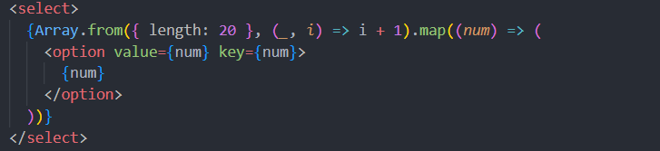
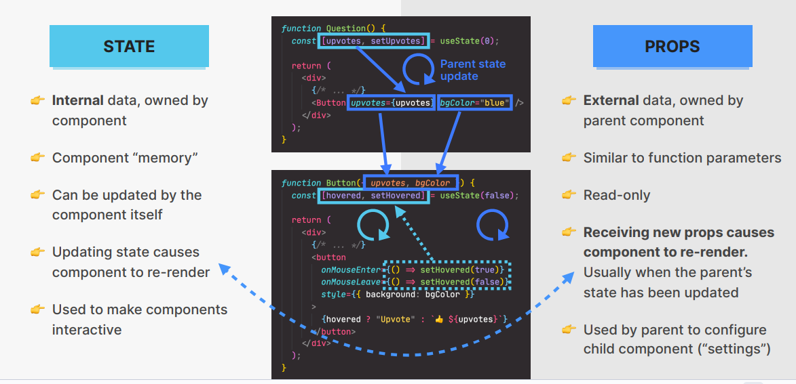
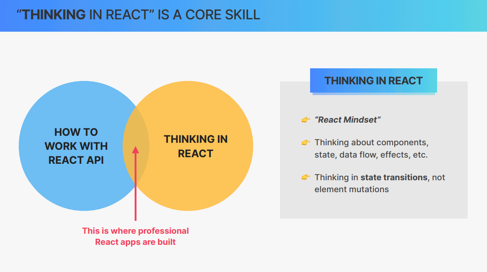
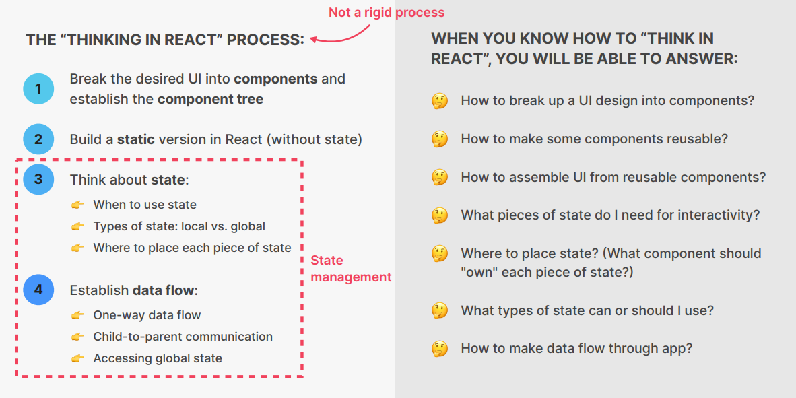

# Building the Layout

App.js

```js
export default function App() {

  return (

    <div className="app">

      <Logo />

      <Form />

      <PackingList />

      <Stats />

    </div>

  );

}

function Logo() {

  return <h1>🌴Far Away💼</h1>;

}

function Form() {

  return (

    <div className="add-form">

      <h3>What do you need for your 😍 trip ?</h3>

    </div>

  );

}

function PackingList() {

  return <div className="list">LIST</div>;

}

function Stats() {

  return (

    <footer className="stats">

      <em>💼 You have X items on your list , and you already packed X (X%)</em>

    </footer>

  );

}
```

index.css

```css
/*

const initialItems = [

  { id: 1, description: "Passports", quantity: 2, packed: false },

  { id: 2, description: "Socks", quantity: 12, packed: false },

];

*/

@import url("https://fonts.googleapis.com/css2?family=Monoton&family=Quicksand:wght@500;700&display=swap");

* {

  margin: 0;

  padding: 0;

  box-sizing: border-box;

}

html {

  font-size: 62.5%;

}

body {

  font-size: 2.4rem;

  font-family: sans-serif;

  color: #5a3e2b;

  font-family: "Quicksand";

  font-weight: 500;

}

.app {

  width: 100%;

  height: 100vh;

  display: grid;

  grid-template-rows: auto auto 1fr auto;

}

h1 {

  text-align: center;

  background-color: #f4a226;

  font-family: "Monoton";

  font-size: 8rem;

  text-transform: uppercase;

  font-weight: 400;

  word-spacing: 30px;

  letter-spacing: -5px;

  padding: 2.4rem 0;

}

.add-form {

  background-color: #e5771f;

  padding: 2.8rem 0;

  display: flex;

  align-items: center;

  justify-content: center;

  gap: 0.8rem;

}

h3 {

  margin-right: 1.6rem;

  font-size: 2.4rem;

}

button,

select,

input {

  background-color: #ffebb3;

  color: #5a3e2b;

  font-family: inherit;

  border: none;

  border-radius: 10rem;

  padding: 1.2rem 3.2rem;

  font-weight: 700;

  font-size: 1.8rem;

  cursor: pointer;

}

.add-form button {

  text-transform: uppercase;

  background-color: #76c7ad;

}

.list {

  background-color: #5a3e2b;

  color: #ffebb3;

  padding: 4rem 0;

  display: flex;

  justify-content: space-between;

  flex-direction: column;

  gap: 3.2rem;

  align-items: center;

}

.actions button,

.list select {

  text-transform: uppercase;

  padding: 0.8rem 2.4rem;

  font-size: 1.4rem;

  font-weight: 700;

  margin: 0 0.8rem;

}

.list ul {

  list-style: none;

  width: 80%;

  overflow: scroll;

  display: grid;

  grid-template-columns: repeat(auto-fit, minmax(250px, 1fr));

  gap: 1.2rem;

  justify-content: center;

  align-content: start;

}

.list li {

  display: flex;

  align-items: center;

  gap: 1.2rem;

}

input[type="checkbox"] {

  height: 2rem;

  width: 2rem;

  accent-color: #e5771f;

}

.list li button {

  cursor: pointer;

  background: none;

  border: none;

  font-size: 1.8rem;

  padding: 0.8rem;

  transform: translateY(2px);

}

.stats {

  background-color: #76c7ad;

  text-align: center;

  font-weight: 700;

  padding: 3.2rem 0;

}
```

# Rendering the Item List

App.js

```js
const initialItems = [

  { id: 1, description: "Passports", quantity: 2, packed: false },

  { id: 2, description: "Socks", quantity: 12, packed: true },

  { id: 2, description: "Charger", quantity: 1, packed: false },

];

export default function App() {

  return (

    <div className="app">

      <Logo />

      <Form />

      <PackingList />

      <Stats />

    </div>

  );

}

function Logo() {

  return <h1>🌴Far Away💼</h1>;

}

function Form() {

  return (

    <div className="add-form">

      <h3>What do you need for your 😍 trip ?</h3>

    </div>

  );

}

function PackingList() {

  return (

    <div className="list">

      <ul>

        {initialItems.map((item) => (

          <Item item={item} />

        ))}

      </ul>

    </div>

  );

}

function Item({ item }) {

  return (

    <li>

      <span style={item.packed ? { textDecoration: "line-through" } : {}}>

        {item.quantity}

        {item.description}

      </span>

      <button>❌</button>

    </li>

  );

}

function Stats() {

  return (

    <footer className="stats">

      <em>💼 You have X items on your list , and you already packed X (X%)</em>

    </footer>

  );

}
```

# Building a Form and Handling Submissions

We use the HTML form element 

To create a bunch of options we use this trick which is used all over in React basically creating a array of 20 elements then mapping it into <options>



We can submit the Form by clicking on the submit button or hitting the enter key when we listen for event handlers on the form .In Single page applications we usually can submit a form without the page reloading . So we disable the default behavior of HTML. As soon as the submit event happens React will call handleSubmit function and when it does so it will pass into the function the event object (object with all the information about the current event) , Similar to what happens in vanilla js , If we listened only on onClick Event then the enter would not be captured

```js
  function Form() {

  function handleSubmit(e) {

    e.preventDefault();

    console.log(e);

  }

  return (

    <form className="add-form" onSubmit={handleSubmit}>

      <h3>What do you need for your 😍 trip ?</h3>

      <select>

        {Array.from({ length: 20 }, (_, i) => i + 1).map((num) => (

          <option value={num} key={num}>

            {num}

          </option>

        ))}

      </select>

      <input type="text" placeholder="Item..." />

      <button>Add</button>

    </form>

  );

}
```

# Controlled Elements

Input fields maintain their own state inside the DOM (inside the HTML elements itself).In React we usually like to keep all the state in just one central place inside the react application and not inside the DOM .In order to do that we use a technique called controlled elements .With this technique it is react who controls and owns the state of the input fields and no longer the DOM . Since we want to now keep this data inside the application what that means is we need some state(Because that form data of course changes over time and we also want to maintain our application in sync with it).In order to implement the controlled elements technique we follow 3 steps 

1. we create a piece of state

2. now we use the state as a value of our input field

3. listen for the change event on the same element and set it to the setter of the state . Whenever we type something in the input field the change event is fired off and we can react to that event with the onChange eventHandler

```js
function Form() {

  const [description, setDescription] = useState("");

  const [quantity, setQuantity] = useState(1);

  function handleSubmit(e) {

    e.preventDefault();

    //gard clause

    if (!description) return; //return if desrciption absent

    //console.log(e);

    const newItem = { description, quantity, packed: false, id: Date.now() };

    console.log(newItem);

    setDescription(""); //reset state to initial state

    setQuantity(1); //reset state to initial state

  }

  return (

    <form className="add-form" onSubmit={handleSubmit}>

      <h3>What do you need for your 😍 trip ?</h3>

      <select

        value={quantity}

        onChange={(e) => setQuantity(Number(e.target.value))}

      >

        {Array.from({ length: 20 }, (_, i) => i + 1).map((num) => (

          <option value={num} key={num}>

            {num}

          </option>

        ))}

      </select>

      <input

        type="text"

        placeholder="Item..."

        value={description}

        onChange={(e) => setDescription(e.target.value)}

      />

      <button>Add</button>

    </form>

  );

}
```

# State vs Props



# Flashcards-Exercise

on the onClick event handler we need to pass in an actual function and not a function call(react will call the functions as soon as the event happens)

```js
function FlashCards() {

  const [selectedId, setSelectedId] = useState(null);

  function handleClick(id) {

    setSelectedId(id !== selectedId ? id : null);

  }

  return (

    <div className="flashcards">

      {questions.map((question) => (

        <div

          key={question.id}

          className={question.id === selectedId ? "selected" : ""}

          onClick={() => handleClick(question.id)}

        >

          <p>

            {question.id === selectedId ? question.answer : question.question}

          </p>

        </div>

      ))}

    </div>

  );

}
```

Entire Code

```js
import { useState } from "react";

import "./styles.css";

export default function App() {

  return (

    <div className="App">

      <FlashCards />

    </div>

  );

}

const questions = [

  {

    id: 3457,

    question: "What language is React based on?",

    answer: "JavaScript",

  },

  {

    id: 7336,

    question: "What are the building blocks of React apps?",

    answer: "Components",

  },

  {

    id: 8832,

    question: "What's the name of the syntax we use to describe a UI in React?",

    answer: "JSX",

  },

  {

    id: 1297,

    question: "How to pass data from parent to child components?",

    answer: "Props",

  },

  {

    id: 9103,

    question: "How to give components memory?",

    answer: "useState hook",

  },

  {

    id: 2002,

    question:

      "What do we call an input element that is completely synchronised with state?",

    answer: "Controlled element",

  },

];

function FlashCards() {

  const [selectedId, setSelectedId] = useState(null);

  function handleClick(id) {

    setSelectedId(id !== selectedId ? id : null);

  }

  return (

    <div className="flashcards">

      {questions.map((question) => (

        <div

          key={question.id}

          className={question.id === selectedId ? "selected" : ""}

          onClick={() => handleClick(question.id)}

        >

          <p>

            {question.id === selectedId ? question.answer : question.question}

          </p>

        </div>

      ))}

    </div>

  );

}
```

# What is Thinking in React ?




